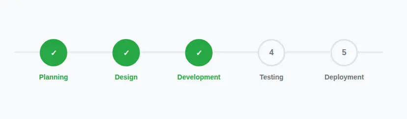
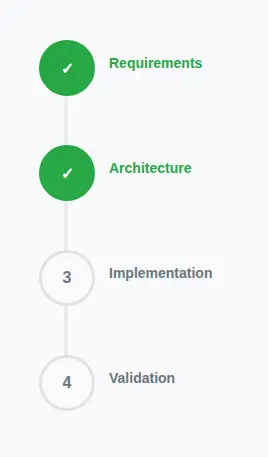

# Progress Tracker

## Installation

From CDN:

```html
<link rel="stylesheet" href="https://cdn.jsdelivr.net/npm/smartart@1/dist/progresstracker.min.css" />
```

Using npm:

```bash
npm install smartart
```

... then import in your CSS:

```css
@import "node_modules/smartart/dist/progresstracker.min.css";
```

## Usage

### Basic Example

Create a progress tracker with semantic HTML using checkboxes to represent completed steps:

```html
<div class="smartart-progresstracker">
  <ul>
    <li><input type="checkbox" checked disabled> Planning</li>
    <li><input type="checkbox" checked disabled> Design</li>
    <li><input type="checkbox" checked disabled> Development</li>
    <li><input type="checkbox" disabled> Testing</li>
    <li><input type="checkbox" disabled> Deployment</li>
  </ul>
</div>
```

[](docs/progresstracker-basic.html)

[See the Basic example](docs/progresstracker-basic.html ":ignore")

### Vertical Progress Tracker

For vertical orientation, add the `vertical` class:

```html
<div class="smartart-progresstracker vertical">
  <ul>
    <li><input type="checkbox" checked disabled> Requirements</li>
    <li><input type="checkbox" checked disabled> Architecture</li>
    <li><input type="checkbox" disabled> Implementation</li>
    <li><input type="checkbox" disabled> Validation</li>
  </ul>
</div>
```

[](docs/progresstracker-vertical.html)

[See the Vertical example](docs/progresstracker-vertical.html ":ignore")

### Checkout Flow Example

Common e-commerce checkout flow:

```html
<div class="smartart-progresstracker">
  <ul>
    <li><input type="checkbox" checked disabled> Cart</li>
    <li><input type="checkbox" disabled> Shipping</li>
    <li><input type="checkbox" disabled> Payment</li>
    <li><input type="checkbox" disabled> Confirmation</li>
  </ul>
</div>
```

### Accessibility

The progress tracker uses real HTML checkboxes (disabled for static display) to ensure:

1. Semantic correctness with GitHub Flavored Markdown
2. Screen reader compatibility
3. Keyboard navigation support
4. Proper focus states

### Responsive Design

The progress tracker automatically adapts to mobile screens at widths below 768px by:

- Converting horizontal trackers to vertical layout
- Reducing step circle size from 50px to 40px
- Adjusting text alignment (left-aligned instead of centered)
- Reducing step margins from 60px to 20px
- Decreasing the left padding from 70px to 60px

## Customization

While the component doesn't use CSS custom properties yet, you can customize the appearance by overriding these CSS selectors:

| Element                                 | CSS Selector                                       | Default Value |
| --------------------------------------- | ------------------------------------------------- | ------------- |
| Step circle size                        | `.smartart-progresstracker li::before`            | `50px`        |
| Connecting line height                  | `.smartart-progresstracker ul::before`            | `4px`         |
| Incomplete line color                   | `.smartart-progresstracker ul::before`            | `#e9ecef`     |
| Completed line & step color             | `.smartart-progresstracker ul::after`             | `#28a745`     |
| Default text color                      | `.smartart-progresstracker li`                    | `#6c757d`     |
| Completed step text color               | `.smartart-progresstracker li:has(input:checked)` | `#28a745`     |
| Horizontal step spacing                 | `.smartart-progresstracker ul`                    | `padding: 0 30px` |
| Vertical step spacing                   | `.smartart-progresstracker.vertical li`           | `margin-bottom: 60px` |

## CSS Structure

The progress tracker uses the following key CSS selectors:

```css
.smartart-progresstracker                  /* Main container */
.smartart-progresstracker ul               /* Step container */
.smartart-progresstracker li               /* Individual step */
.smartart-progresstracker li::before       /* Step circle */
.smartart-progresstracker ul::before       /* Base connecting line */
.smartart-progresstracker ul::after        /* Progress fill line */
.smartart-progresstracker.vertical         /* Vertical orientation */
```
