# Themes

## Installation

From CDN:

```html
<link rel="stylesheet" href="https://cdn.jsdelivr.net/npm/smartart@1/dist/themes.min.css" />
```

Using npm:

```bash
npm install smartart
```

... then import in your CSS:

```css
@import "node_modules/smartart/dist/themes.min.css";
```

## Usage

To use a theme, add the theme class to your smartart element. For example:

```html
<ul class="smartart-chevron smartart-theme-office" style="--chevron-width: 150px">
  ...
</ul>
```

### Office

[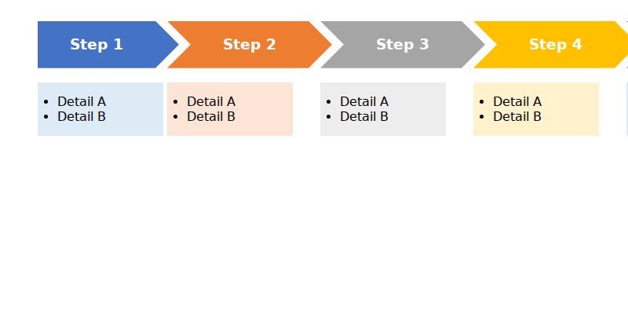](docs/theme-office.html ":include height=300px")

### Grayscale

[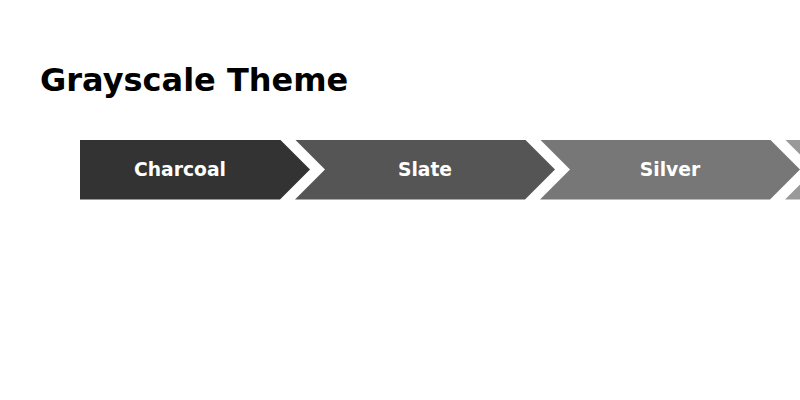](docs/theme-grayscale.html ":include height=300px")

### Blue Warm

[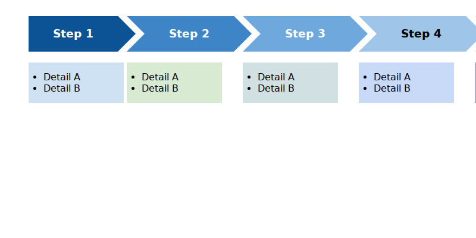](docs/theme-blue-warm.html ":include height=300px")

### Blue II

[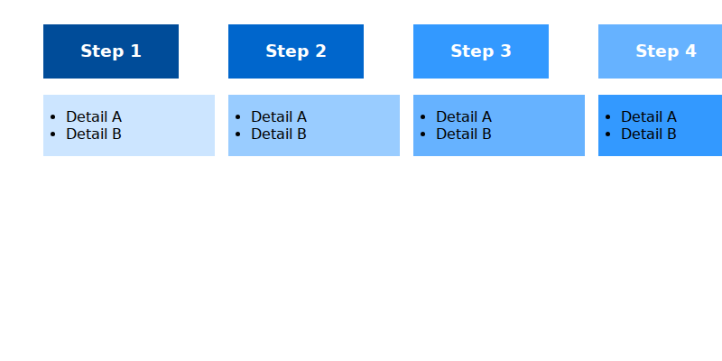](docs/theme-blue-ii.html ":include height=300px")

### Tableau

[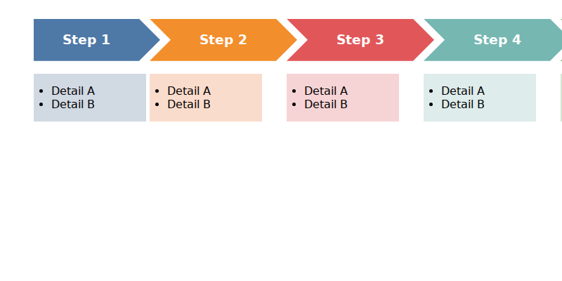](docs/theme-tableau.html ":include height=300px")

### D3

[](docs/theme-d3.html ":include height=300px")

### Colorblind Safe

[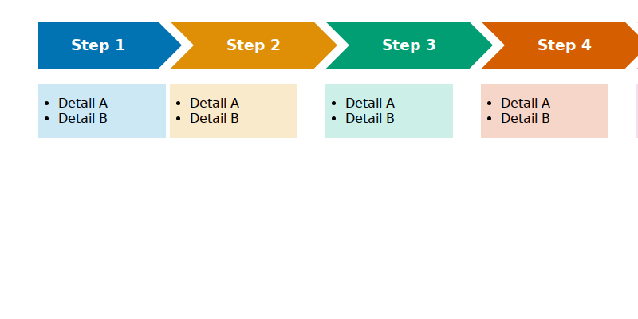](docs/theme-colorblind-safe.html ":include height=300px")

### Viridis

[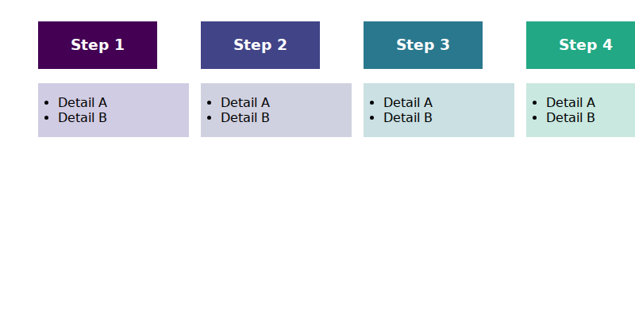](docs/theme-viridis.html ":include height=300px")

### Monokai

[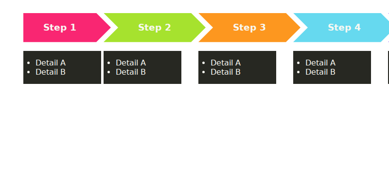](docs/theme-monokai.html ":include height=300px")

### Solarized Light

[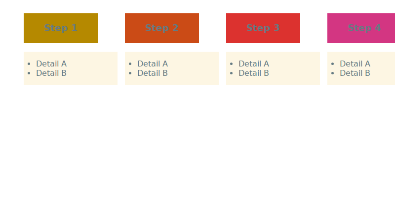](docs/theme-solarized-light.html ":include height=300px")

### Solarized Dark

[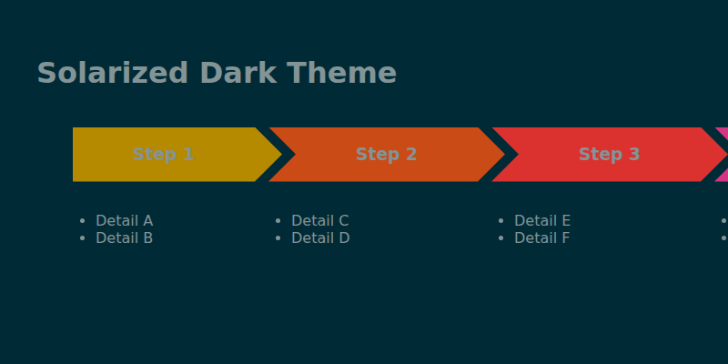](docs/theme-solarized-dark.html ":include height=300px")

### Dracula

[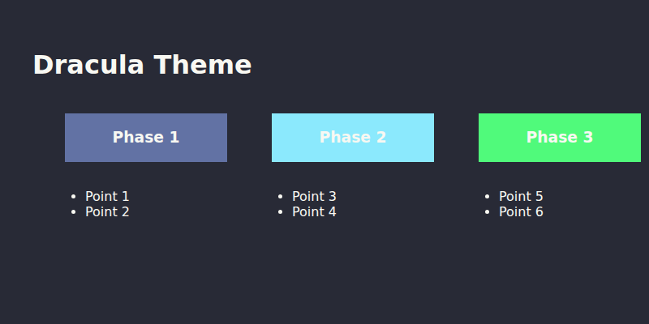](docs/theme-dracula.html ":include height=300px")
